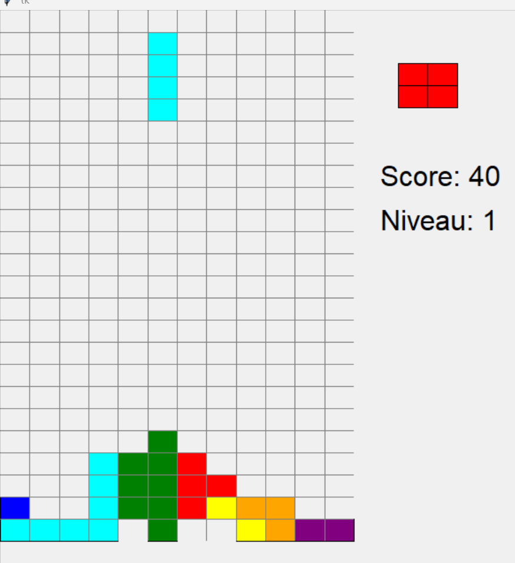
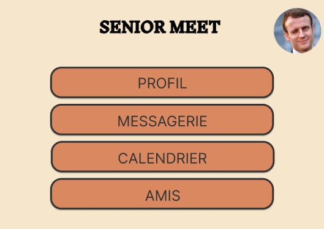
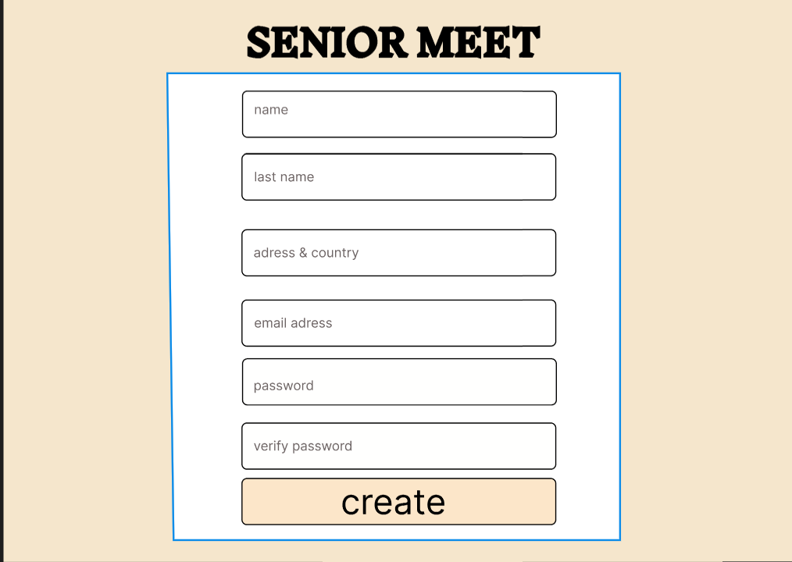

<!DOCTYPE html>
<html lang="fr">
<head>
  <meta charset="UTF-8">
  <meta name="viewport" content="width=device-width, initial-scale=1.0">
  <title>Portfolio Ayoub</title>
  <link rel="stylesheet" href="Portfolio.css">
  <link href="https://fonts.googleapis.com/css2?family=Poppins:wght@300;400;500;600;700&display=swap" rel="stylesheet">
  <link href="https://fonts.googleapis.com/css2?family=Montserrat:wght@400;500;600;700;800&display=swap" rel="stylesheet">
</head>
<body>
  
  <header class="header">
    

      

        <h1 class="logo">Portfolio.</h1>
        

        <nav class="desktop-nav">
          <ul>
            <li><a href="#a-propos">À propos</a></li>
            <li><a href="#bd">Base de Données</a></li>
            <li><a href="#tetris">Jeu Tetris</a></li>
            <li><a href="#muraille">Muraille de Chine</a></li>
            <li><a href="#yams">Jeu Yams</a></li>
            <li><a href="#seniors">Plateforme Seniors</a></li>
          </ul>
        </nav>
  
  
    

  </header>

  <section class="hero">
    

      

        <h1 class="hero-title">Ayoub.</h1>
        
Étudiant en BUT Informatique à l'Université Gustave Eiffel

        
Passionné par la cybersécurité et le développement web

        

          <a href="#a-propos" class="btn btn-primary">En savoir plus</a>
          <a href="#contact" class="btn btn-outline">Contact</a>
        

      

    

    

      

      

      

    

  </section>

  
  <section id="a-propos" class="about section">
    

      <h2 class="section-title">À propos de moi</h2>
      
      

        

          

            

              Je m'appelle <strong>Ayoub Kherbouche</strong> et je suis actuellement en 
              première année de BUT Informatique à l'Université Gustave Eiffel. 
              Je suis passionné par l'informatique et, plus particulièrement, 
              par la cybersécurité, un domaine dans lequel je souhaite 
              travailler plus tard.
            

            

              Ma curiosité et mon enthousiasme pour le développement de projets 
              informatiques m'ont poussé à explorer de nombreuses technologies 
              et langages de programmation. Dans ce portfolio, je vous présente 
              quelques-unes de mes réalisations.
            

            

              En dehors de la programmation, j'aime également me documenter 
              sur les avancées technologiques et élargir mes connaissances 
              en cybersécurité afin de mieux comprendre et anticiper les 
              menaces informatiques.
            

          

        

        
        

          

            
            

              <h3>Mes compétences</h3>
              

                HTML/CSS
                JavaScript
                SQL
                Java
                Cybersécurité
              

            

          

        

      

    

  </section>

  <section class="projects section bg-light">
    

      <h2 class="section-title">Mes Projets</h2>
      
      

        

          

            
          

          

            <h3 class="project-title">Création d'une Base de Données</h3>
            

              MySQL
              PostgreSQL
              SQL
              Bases de données
            

            

              Dans ce projet, j'ai travaillé sur la conception et la mise en place d'une base de données complète pour gérer efficacement les informations des utilisateurs et des produits. J'ai utilisé des outils et technologies tels que MySQL, PostgreSQL ou SQL Server (selon le besoin) afin d'assurer une structure solide, ainsi qu'une bonne performance pour les requêtes complexes.
            

            

              Cette expérience m'a permis de développer mes compétences en modélisation de données et optimisation des requêtes SQL, créant ainsi une base solide pour mes futurs projets.
            

            <a href="#bd-detail" class="project-link">En savoir plus</a>
          

        

        

          

           

          

          

            <h3 class="project-title">Codage du Jeu Tetris</h3>
            

              Python
              Programmation orientée objet
              Logique de jeu
              Interface utilisateur
            

            

              Dans ce projet, j'ai codé une version simplifiée du célèbre jeu Tetris en utilisant Python. J'ai commencé par définir la logique du jeu : la création et le déplacement des pièces (tétrominos), la détection de collisions, ainsi que la gestion du score.
            

            

              Le principal défi résidait dans la manipulation de la grille de jeu (placement des blocs, suppression des lignes complètes, etc.) et l'implémentation des différentes formes de tétrominos (I, O, T, S, Z, J, L).
            

            <a href="#tetris-detail" class="project-link">En savoir plus</a>
            

          

        

        

          

            
          

          

            <h3 class="project-title">Création d'un Site Web sur la Muraille de Chine</h3>
            

              HTML
              CSS
              Figma
              Responsive Design
            

            

              J'ai réalisé un site Web présentant l'histoire et les caractéristiques de la Grande Muraille de Chine. Le site est structuré en plusieurs pages, avec des sections consacrées à l'historique, à la géographie et à l'impact culturel de cet édifice.
            

            

              Pour ce projet, j'ai commencé par créer une maquette détaillée sur Figma, ce qui m'a permis de planifier l'architecture et le design du site avant de passer à l'implémentation. J'ai ensuite développé le site en utilisant uniquement HTML et CSS.
            

            <a href="#muraille-detail" class="project-link">En savoir plus</a>
          

        

      

        

          

            
          

          

            <h3 class="project-title">Jeu Yams en Java</h3>
            

              Java
              Console
              Jeu
              POO
            

            

              Projet réalisé au deuxième semestre : un jeu de Yams programmé en Java. Il comprend la gestion des dés, du score et des règles officielles, en utilisant la programmation orientée objet.
            

            

              Ce projet m’a permis d’approfondir ma maîtrise de Java et de structurer un programme en plusieurs classes de manière claire et modulaire.
            

            <a href="#yams-detail" class="project-link">En savoir plus</a>
          

        

    
        

          

            
          

          

            <h3 class="project-title">Plateforme Web pour les Seniors</h3>
            

              HTML
              CSS
              Chat
              Calendrier
              Agenda
            

            

              Site web destiné aux seniors intégrant un système de messagerie, un calendrier interactif et un agenda personnel. L’interface est simple et accessible, conçue pour répondre aux besoins des personnes âgées.
            

            

              Ce projet m’a permis de réfléchir à l’ergonomie, à la simplicité d’utilisation et aux défis de l’accessibilité numérique.
            

            <a href="#seniors-detail" class="project-link">En savoir plus</a>
          

        

      

    

  </section>

  
  <section id="bd-detail" class="project-detail">
    

      <h2 class="section-title bordered">Création d'une Base de Données</h2>
      
      

        

          

            

              Dans ce projet, j'ai travaillé sur la conception et la mise en place d'une base de données complète pour gérer efficacement les informations des utilisateurs et des produits. J'ai utilisé des outils et technologies tels que MySQL, PostgreSQL ou SQL Server (selon le besoin) afin d'assurer une structure solide, ainsi qu'une bonne performance pour les requêtes complexes.
            

            

              Ce projet m'a permis de développer mes compétences en modélisation de données, optimisation des requêtes SQL et création d'index. J'ai appris à concevoir des bases de données performantes qui répondent aux besoins spécifiques des applications tout en assurant l'intégrité des données.
            

            

              J'ai également pu explorer différentes méthodes d'accès aux données et comprendre les avantages et inconvénients de différentes approches de modélisation selon les cas d'usage.
            

          

        

        
        

          

            
            
          

        

      

    

  </section>

  <section id="tetris-detail" class="project-detail">
    

      <h2 class="section-title bordered">Codage du Jeu Tetris en Python</h2>
      
      

        

          

            

              Dans ce projet, j'ai codé une version simplifiée du célèbre jeu Tetris en utilisant Python. J'ai commencé par définir la logique du jeu : la création et le déplacement des pièces (tétrominos), la détection de collisions, ainsi que la gestion du score.
            

            

              Le principal défi résidait dans la manipulation de la grille de jeu (placement des blocs, suppression des lignes complètes, etc.) et l'implémentation des différentes formes de tétrominos (I, O, T, S, Z, J, L).
            

            

              Au final, ce projet m'a permis d'approfondir ma compréhension de la programmation orientée objet en Python et de la logique de jeu. J'ai également eu l'opportunité de travailler sur des aspects importants tels que la gestion des collisions, des rotations des pièces et de l'interface utilisateur avec la bibliothèque Pygame.
            

          

        

        
        

          

            

          

        

      

    

  </section>

  <section id="muraille-detail" class="project-detail">
    

      <h2 class="section-title bordered">Création d'un Site Web sur la Muraille de Chine</h2>
      
      

        

          

            

              J'ai réalisé un site Web présentant l'histoire et les caractéristiques de la Grande Muraille de Chine. Le site est structuré en plusieurs pages, avec des sections consacrées à l'historique, à la géographie et à l'impact culturel de cet édifice.
            

            

              Pour ce projet, j'ai commencé par créer une maquette détaillée sur Figma, ce qui m'a permis de planifier l'architecture et le design du site avant de passer à l'implémentation. J'ai ensuite développé le site en utilisant uniquement HTML et CSS , en mettant l'accent sur un design responsive et une navigation intuitive.
            

            

              Ce projet m'a permis de renforcer mes compétences en intégration web (HTML/CSS) et d'apprendre à optimiser un site pour une bonne expérience utilisateur. J'ai également étudié les principes du responsive design pour assurer une expérience fluide sur tous les appareils.
            

          

        

        
        

          

            
            
          

        

      

    

  </section>

  <section id="yams-detail" class="project-detail">
    

      <h2 class="section-title bordered">Jeu Yams en Java</h2>
      

        

          

            

              Le jeu de Yams que j’ai codé en Java repose sur une implémentation console. Chaque joueur peut lancer les dés, choisir quelles combinaisons conserver, et son score est calculé automatiquement selon les règles classiques.
            

            

              Ce projet m’a permis de développer mes compétences en programmation orientée objet et en conception de classes pour représenter les dés, le joueur et le plateau de jeu.
            

            

              Le projet utilise des boucles, des tableaux et des classes Java, ce qui a renforcé mes bases en algorithmique et structuration de projet.
            

          

        

        

          

            
          

        

      

    

  </section>

  <section id="seniors-detail" class="project-detail">
    

      <h2 class="section-title bordered">Plateforme Web pour les Seniors</h2>
      

        

          

            

              Cette plateforme vise à faciliter la vie numérique des personnes âgées. Elle propose une messagerie intuitive, un calendrier interactif et un agenda personnel pour suivre les rendez-vous et tâches.
            

            

              J’ai conçu cette interface en HTML/CSS avec un design clair et accessible. Chaque fonctionnalité est pensée pour minimiser les clics et maximiser la lisibilité.
            

            

              Ce projet m’a permis de réfléchir à l'accessibilité web et à la création de services numériques inclusifs.
            

          

        

        

          

            
            
          

        

      

    

  </section>

 
  <footer class="footer" id="contact">
    

      

        

          <h3 class="footer-title">Portfolio.</h3>
          

            Portfolio professionnel d'Ayoub, étudiant en BUT Informatique
            à l'Université Gustave Eiffel.
          

        

        
        

          <h3 class="footer-subtitle">Navigation</h3>
          <ul>
            <li><a href="#a-propos">À propos</a></li>
            <li><a href="#bd">Base de Données</a></li>
            <li><a href="#tetris">Jeu Tetris</a></li>
            <li><a href="#muraille">Muraille de Chine</a></li>
            <li><a href="#yams">Jeu Yams</a></li>
            <li><a href="#seniors">Plateforme Seniors</a></li>
          </ul>
        

        
        

          <h3 class="footer-subtitle">Contact</h3>
          <ul>
            <li><strong>Email:</strong> ayoubkherbouche93160@gmail.com</li>
            <li><strong>LinkedIn:</strong><a href="https://www.linkedin.com/in/ayoub-kherbouche-311087338/">linkedIn</a></li>
            <a href="cv.pdf" target="_blank" style="padding: 10px; background-color: #007BFF; color: white; text-decoration: none; border-radius: 5px;">📄 Télécharger mon CV</a>

          </ul>
        

      

    

  </footer>
</body>
</html>
